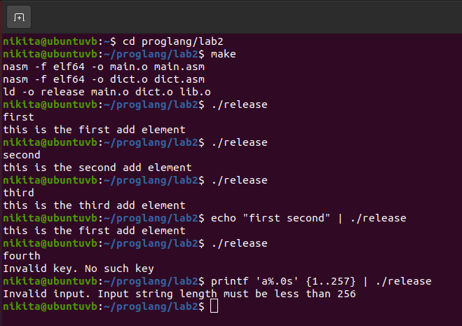

# Assignment №2:  Dictionary in assembly
---
Лабораторная работа №2: словарь на assembler

# Примечания к лабораторной работе

* Библиотека из первой лабораторной работы предварительно скомпилирована в lib.o и добавлена в проект
* Так как в предыдущей лабораторной работе не было функции вывода строки в stderr, данная функция реализована в файле main.asm
* В файле dict.asm реализована функция get_value для получения значения элемента словаря

# Результат работы программы



# Подготовка

* Прочитайте первые главы 3,4,5 "Low-level programming: C, assembly and program execution". 

На защите мы можем обсуждать цикл компиляции, роль компоновщика, препроцессора, устройство виртуальной памяти и связь между секциями, сегментами, регионами памяти. Также можем поговорить про кольца защиты и привилегированный режим.


## Связный список

Связный список &mdash; это структура данных. Пустой список это нулевой указатель; непустой список это указатель на первый элемент списка.
Каждый элемент содержит данные и указатель на следующий элемент.


Вот пример связного списка (100, 200, 300). 
Его начало можно найти по указателю `x1`:

```nasm
section .data

x1: 
dq x2
dq 100

x2: 
dq x3
dq 200

x3: 
dq 0
dq 300
```
 
Часто есть необходимость хранить набор данных в каком-то контейнере. С контейнером мы производим операции доступа к его элементам, добавления элемента в начало или конец, или на произвольную позицию, сортировки.

Разные контейнеры делают одни из этих операций лёгкими и быстрыми, а другие &mdash; медленными.
Например, в массив неудобно добавлять элементы, но можно быстро обратиться к уже сущестующему по индексу.
В связный список, наоборот, удобно добавлять элементы в любое место, но доступ по индексу сложнее &mdash; нужно просмотреть весь список с самого начала.

## Задание

Необходимо реализовать на ассемблере словарь в виде связного списка.
Каждое вхождение содержит адрес следующей пары в словаре, ключ и значение. 
Ключи и значения &mdash; адреса нуль-терминированых строк.

Словарь задаётся статически, каждый новый элемент добавляется в его начало. 
С помощью макросов мы автоматизируем этот процесс так, что указав с помощью новой конструкции языка новый элемент он автоматически добавится в начало списка, и указатель на начало списка обновится. Таким образом нам не нужно будет вручную поддерживать правильность связей в списке. 

Создайте макрос `colon` с двумя аргументами: ключом и меткой, которая будет сопоставлена значению.
Эта метка не может быть сгенерирована из самого значения, так как в строчке могут быть символы, которые не могут встречаться в метках, например, арифметические знаки, знаки пунктуации и т.д. После использования такого макроса можно напрямую указать значение, сопоставляемое ключу. Пример использования:

```nasm
section .data

colon "third word", third_word
db "third word explanation", 0

colon "second word", second_word
db "second word explanation", 0 

colon "first word", first_word
db "first word explanation", 0 
```


В реализации необходимо предоставить следующие файлы:

- `main.asm`
- `lib.asm`
- `dict.asm`    
- `colon.inc`

### Указания

- Оформите функции, которые вы реализовали в первой лабораторной работе, в виде отдельной библиотеки `lib.o`.

  Не забудьте все названия функций сделать глобальными метками.

- Создайте файл `colon.inc` и определите в нём макрос для создания слов в словаре. 

  Макрос принимает два параметра:
    - Ключ (в кавычках)
    - Имя метки, по которой будет находиться значение.

- В файле `dict.asm` создать функцию `find_word`. Она принимает два аргумента:
  - Указатель на нуль-терминированную строку.
  - Указатель на начало словаря.

  `find_word` пройдёт по всему словарю в поисках подходящего ключа. Если подходящее вхождение найдено, вернёт адрес *начала вхождения в   словарь* (не значения), иначе вернёт 0. 

- Файл `words.inc` должен хранить слова, определённые с помощью макроса  `colon`. Включите этот файл в `main.asm`.
- В `main.asm` определите функцию `_start`, которая:
  
  - Читает строку размером не более 255 символов в буфер с `stdin`.
  - Пытается найти вхождение в словаре; если оно найдено, распечатывает в `stdout` значение по этому ключу. Иначе выдает сообщение об ошибке.

  Не забудьте, что сообщения об ошибках нужно выводить в `stderr`.

- Обязательно предоставьте `Makefile`.
